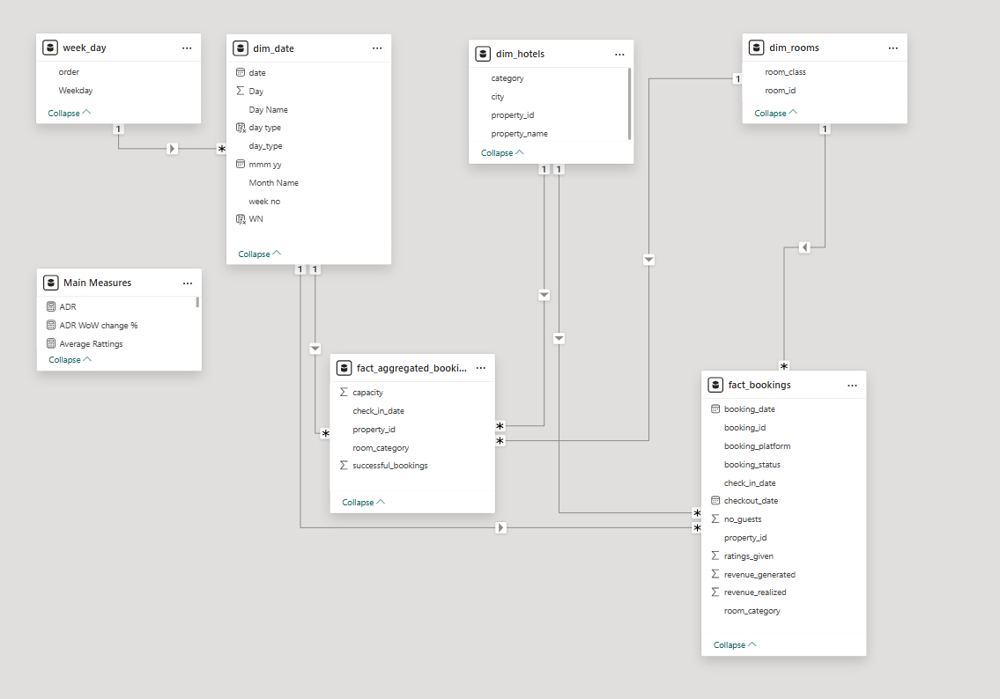
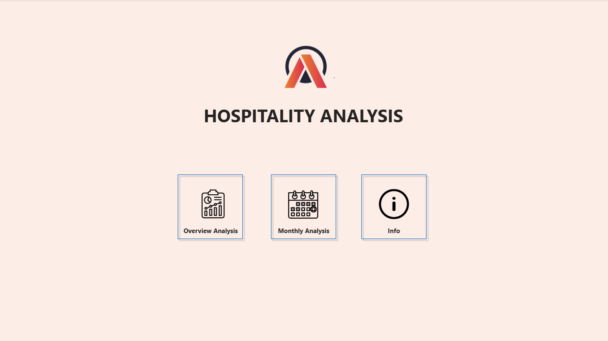
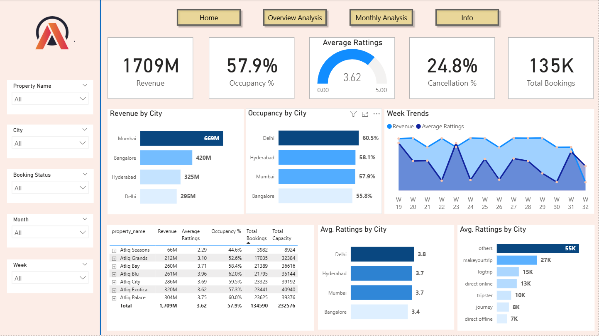
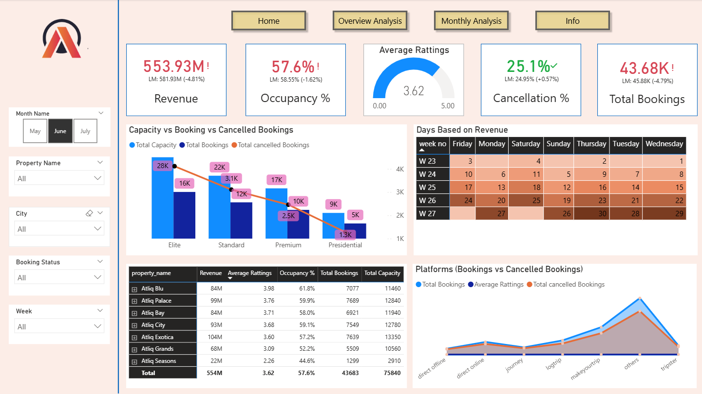

# 🏨 Hospitality Analytics Dashboard - AtliQ Grands

This project presents a Power BI dashboard created to support the revenue management team of **AtliQ Grands**, a luxury hotel chain in India, in making data-driven decisions to regain lost market share and optimize revenue.

---

## 📌 Project Overview

**Client**: AtliQ Grands  
**Domain**: Hospitality, Business Intelligence  
**Tool Used**: Power BI  
**Focus Areas**: Revenue Trends, Ratings, Room Performance, Booking Patterns  

AtliQ Grands has been facing a decline in market share and revenue due to increased competition and ineffective management decisions. Without an in-house data team, they hired external analytics support to derive insights from historical booking data.

This project analyzes their revenue and performance using Power BI dashboards.

---

## 🎯 Objectives

- Analyze weekly trends in **revenue** and **average ratings**
- Identify top-performing **properties** and **room types**
- Detect data issues and filter inconsistencies
- Provide the revenue team with a dashboard for quick, informed decision-making

---

## 📊 Dashboard Features

- 📅 Weekly revenue and rating trends  
- 🏢 Property-wise performance breakdown  
- 🛏️ Room category comparisons  
- 📈 Visual insights on booking volume and revenue realized  
- ⚠️ Handling of missing or unmatched dates in bookings

---

## 🧠 Key Learnings

- Advanced DAX functions for time intelligence  
- Resolving “Blank” entries in visuals caused by unmatched dates  
- Filtering fact table data based on dimension table relationship using `TREATAS` and `CROSSFILTER`  
- Designing clean, interactive dashboards with business users in mind

---

## 🖼️ Screenshots

### 📌 Data Modelling

### 📈 Home

### 📈 Overview Analysis

### 🏢 Property Performance

### 🏢 Monthly Analysis

---

## 🛠 Tools & Technologies

- Power BI (Data Modeling, DAX, Visualization)
- Excel (Initial Data Review)
- GitHub (Project Versioning & Sharing)
